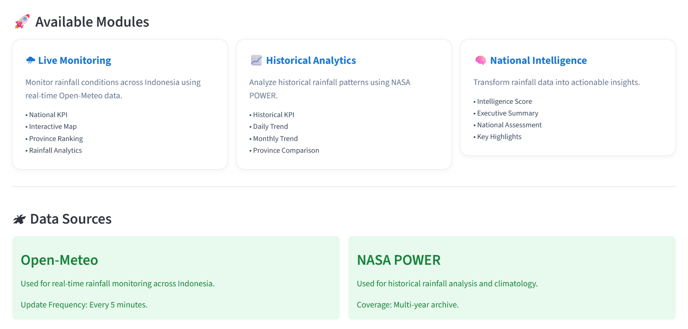

# 🌧 Indonesia Rainfall Intelligence Platform

> A professional rainfall intelligence dashboard that integrates **real-time monitoring**, **historical climate analysis**, **rainfall forecasting**, and **national intelligence** into a unified decision-support platform for Indonesia.

---

## 🚀 Live Demo

👉 **[Open Dashboard](https://indonesia-rainfall-intelligence-platform.streamlit.app/)**

---

## 🌍 Overview

The **Indonesia Rainfall Intelligence Platform** is an interactive analytics dashboard designed to monitor and analyze rainfall conditions across Indonesia. The platform combines multiple authoritative weather and climate data sources to provide comprehensive rainfall intelligence through four integrated analytical modules.

Unlike conventional weather dashboards that simply display observations, this platform transforms raw rainfall data into meaningful insights by combining:

- **Current rainfall observations**
- **Historical climate records**
- **Short-term rainfall forecasts**
- **Executive-level rainfall intelligence**

The goal is to help users better understand rainfall patterns, identify significant changes, compare historical conditions, and support data-driven decision making.

<p align="center">
  
</p>

---

## ✨ Key Features

### 🌧 Live Monitoring

Monitor current rainfall conditions across all Indonesian provinces using near real-time weather observations.

Features include:

- Real-time rainfall monitoring
- Interactive rainfall map
- National rainfall KPIs
- Province search
- Wettest & driest province rankings
- Rainfall distribution analysis
- Responsive interface

<p align="center">
  
</p>

<p align="center">
  
</p>

---

### 📈 Historical Analytics

Analyze long-term rainfall behavior using NASA POWER historical climate records.

Features include:

- Daily rainfall trend
- Monthly rainfall seasonality
- Historical rainfall statistics
- Province comparison
- Interactive historical charts
- Historical dataset explorer
- Automated historical summary

<p align="center">
  
</p>

<p align="center">
  
</p>

<p align="center">
  
</p>

---

### 🔮 Forecast Analytics

Explore short-term rainfall forecasts using Open-Meteo Forecast API.

Features include:

- 3-day forecast
- 7-day forecast
- 14-day forecast
- Forecast KPIs
- Forecast Intelligence
- Forecast Outlook
- Rainfall intensity visualization
- Interactive forecast trend

<p align="center">
  
</p>

---

### 🧠 National Intelligence

Integrate real-time, historical, and forecast information into a unified executive dashboard.

Features include:

- National Rainfall Intelligence Score
- Executive Summary
- Current Situation Assessment
- Historical Context
- Forecast Context
- National Key Highlights
- Decision-support insights

<p align="center">
  
</p>

---

### 📱 User Experience

The platform also includes several usability improvements:

- Responsive desktop & mobile layout
- Centralized loading indicators
- Consistent dashboard design
- Shared UI components
- Built-in methodology documentation
- Built-in metric definitions
- Modular architecture

---

## 🛠 Technology Stack

| Category | Technology |
|-----------|------------|
| Programming Language | Python |
| Dashboard Framework | Streamlit |
| Data Processing | Pandas |
| Interactive Charts | Altair |
| Interactive Mapping | Folium |
| Historical Climate Data | NASA POWER API |
| Weather Forecast | Open-Meteo API |
| Responsive Layout | Streamlit + Custom CSS |
| Version Control | Git & GitHub |

---

## 🎯 Project Objectives

This project aims to:

- Provide a centralized rainfall monitoring platform for Indonesia.
- Improve accessibility of rainfall information through interactive dashboards.
- Support historical climate analysis.
- Deliver short-term rainfall forecasting.
- Produce executive-level rainfall intelligence using rule-based analytics.
- Demonstrate modern data analytics and dashboard engineering practices using Python and Streamlit.

---

# 🏗 Application Architecture

The platform is organized into four analytical layers that transform raw weather data into actionable rainfall intelligence.

```text
                    Home Dashboard
                           │
      ┌────────────────────┼────────────────────┐
      │                    │                    │
      ▼                    ▼                    ▼
 Live Monitoring   Historical Analytics   Forecast Analytics
      │                    │                    │
      └────────────────────┼────────────────────┘
                           ▼
              National Rainfall Intelligence
                           │
                           ▼
               Executive Decision Support
```

Each analytical module has a distinct responsibility:

| Module | Purpose |
|----------|---------|
| 🌧 Live Monitoring | Monitor current rainfall conditions across Indonesia |
| 📈 Historical Analytics | Analyze historical rainfall patterns and climate trends |
| 🔮 Forecast Analytics | Predict upcoming rainfall conditions |
| 🧠 National Intelligence | Integrate all analytical modules into executive-level insights |

---

# ⚙ Application Workflow

The platform follows a layered architecture where each layer has a single responsibility.

```text
Weather APIs
(Open-Meteo / NASA POWER)
                │
                ▼
            Services
                │
                ▼
      Statistics & Utilities
                │
                ▼
      Reusable Components
                │
                ▼
         Dashboard Pages
                │
                ▼
          User Interface
```

This separation improves:

- Maintainability
- Reusability
- Scalability
- Testability

---

# 📂 Project Structure

```text
indonesia-rainfall-intelligence-platform/

├── assets/
│   └── styles.css
│
├── components/
│   ├── forecast/
│   ├── historical/
│   ├── intelligence/
│   ├── live/
│   └── shared/
│
├── config/
│   ├── app.py
│   ├── cache.py
│   └── theme.py
│
├── pages/
│   ├── 1_Live_Monitoring.py
│   ├── 2_Historical_Analytics.py
│   ├── 3_Forecast_Analytics.py
│   └── 4_National_Intelligence.py
│
├── services/
│
├── utils/
│
├── Home.py
├── requirements.txt
└── README.md
```

---

# 📦 Directory Overview

| Directory | Responsibility |
|------------|----------------|
| **assets** | Global stylesheets and static assets |
| **components** | Reusable dashboard components |
| **config** | Centralized application configuration |
| **pages** | Main Streamlit application pages |
| **services** | API communication and data retrieval |
| **utils** | Shared helper functions and business logic |

---

# 🧩 Dashboard Modules

## 🏠 Home

The landing page introduces the platform and provides navigation to all analytical modules.

Main contents:

- Platform overview
- Feature cards
- Application introduction
- Navigation

---

## 🌧 Live Monitoring

Provides near real-time rainfall observations across Indonesian provinces.

Main components:

- National KPIs
- Rainfall Map
- Province Search
- Province Detail
- Rainfall Analytics
- Wettest & Driest Provinces
- Leaderboard
- Documentation

---

## 📈 Historical Analytics

Analyzes historical rainfall records from NASA POWER.

Main components:

- Historical KPIs
- Historical Summary
- Daily Trend
- Monthly Seasonality
- Province Comparison
- Historical Dataset
- Documentation

---

## 🔮 Forecast Analytics

Visualizes short-term rainfall forecasts.

Main components:

- Forecast KPIs
- Forecast Summary
- Forecast Intelligence
- Forecast Trend
- Forecast Outlook
- Documentation

---

## 🧠 National Intelligence

Integrates all rainfall information into a decision-support dashboard.

Main components:

- Intelligence Hero
- Executive Summary
- National Assessment
- Current Situation
- Historical Context
- Forecast Context
- Key Highlights
- Documentation

---

# 🔄 Design Principles

The platform was designed based on several software engineering principles.

### Modular Architecture

Each dashboard feature is implemented as an independent reusable component.

---

### Single Responsibility Principle

Each module has one primary responsibility.

Examples:

- Services retrieve data.
- Components render user interfaces.
- Utilities perform calculations.
- Configuration stores global settings.

---

### Reusability

Shared components such as:

- Footer
- Loading indicators
- Documentation
- Page Header

are implemented once and reused throughout the application.

---

### Consistency

All dashboard pages follow the same layout:

```text
Header
      ↓
Filters
      ↓
Overview
      ↓
Summary
      ↓
Analytics
      ↓
Supporting Tables
      ↓
Documentation
      ↓
Footer
```

---

# 📖 Methodology

The Indonesia Rainfall Intelligence Platform integrates multiple weather and climate data sources to provide comprehensive rainfall intelligence.

The analytical workflow consists of four primary stages:

```text
Current Observation
        │
        ▼
Historical Analysis
        │
        ▼
Rainfall Forecast
        │
        ▼
National Intelligence
```

Rather than presenting raw rainfall values alone, the platform transforms observations into statistical summaries and executive-level insights.

---

## 🌧 Live Monitoring Methodology

**Objective**

Monitor near real-time rainfall conditions across Indonesian provinces.

### Data Source

- Open-Meteo API

### Spatial Resolution

Province centroid coordinates

### Temporal Resolution

Current daily accumulated precipitation

### Processing

- Retrieve rainfall observations
- Calculate national statistics
- Rank provinces
- Classify rainfall intensity
- Generate dashboard visualizations

---

## 📈 Historical Analytics Methodology

**Objective**

Analyze historical rainfall behavior over a selected period.

### Data Source

NASA POWER

Dataset:

- PRECTOTCORR

### Temporal Resolution

Daily rainfall observations

### Processing

- Daily rainfall trend
- Monthly aggregation
- Rainfall statistics
- Province comparison
- Historical summaries

---

## 🔮 Forecast Analytics Methodology

**Objective**

Provide short-term rainfall forecasts.

### Data Source

Open-Meteo Forecast API

### Forecast Horizon

- 3 Days
- 7 Days
- 14 Days

### Processing

- Daily rainfall forecast
- Forecast statistics
- Rainfall intensity assessment
- Forecast Intelligence
- Forecast Outlook

---

## 🧠 National Intelligence Methodology

National Intelligence combines outputs from all analytical modules.

```text
Live Monitoring

+

Historical Analytics

+

Forecast Analytics

↓

Executive Intelligence
```

The module applies rule-based analytical logic to summarize national rainfall conditions.

Outputs include:

- Intelligence Score
- Executive Summary
- Current Situation
- Historical Context
- Forecast Context
- Key Highlights

---

# 🌍 Data Sources

| Source | Purpose |
|----------|---------|
| NASA POWER | Historical rainfall observations |
| Open-Meteo | Current rainfall observations |
| Open-Meteo Forecast | Rainfall forecasts |

---

# 🚀 Installation

Clone the repository.

```bash
git clone https://github.com/zeevolker/indonesia-rainfall-intelligence-platform.git
```

Move into the project directory.

```bash
cd indonesia-rainfall-intelligence-platform
```

Create a virtual environment.

```bash
python -m venv venv
```

Activate the virtual environment.

### Windows

```bash
venv\Scripts\activate
```

### macOS / Linux

```bash
source venv/bin/activate
```

Install dependencies.

```bash
pip install -r requirements.txt
```

---

# ▶ Running the Application

Start the Streamlit application.

```bash
streamlit run Home.py
```

The application will automatically open in your web browser.

---

# 💡 Usage

Typical workflow:

1. Explore current rainfall conditions using **Live Monitoring**.
2. Investigate historical rainfall patterns using **Historical Analytics**.
3. Review expected rainfall using **Forecast Analytics**.
4. Use **National Intelligence** for executive-level assessment.

---

# 🗺 Future Roadmap

The following enhancements are planned for future versions.

- Machine Learning rainfall prediction
- Rainfall anomaly analysis
- Flood risk assessment
- Satellite imagery integration
- PDF report generation
- REST API
- User authentication
- Export dashboard data

---

# 🤝 Contributing

Contributions are welcome.

If you would like to improve this project:

1. Fork the repository.
2. Create a feature branch.
3. Commit your changes.
4. Submit a Pull Request.

---

## 📄 License

This project is licensed under the **MIT License**.

See the [LICENSE](LICENSE) file for details.

---

# 👨‍💻 Author

**Muhamad Zidan**

Information Systems Student

Passionate about:

- Data Analytics
- Data Visualization
- Data Engineer
- Business Intelligence
- Geographic Information Systems
- Artificial Intelligence
- Machine Learning
- And More About Technology

---

## ⭐ Acknowledgements

Special thanks to the following organizations for providing open data services.

- NASA POWER
- Open-Meteo
- Streamlit
- Folium
- Altair
- Pandas

---

If you find this project useful, consider giving it a ⭐ on GitHub.
